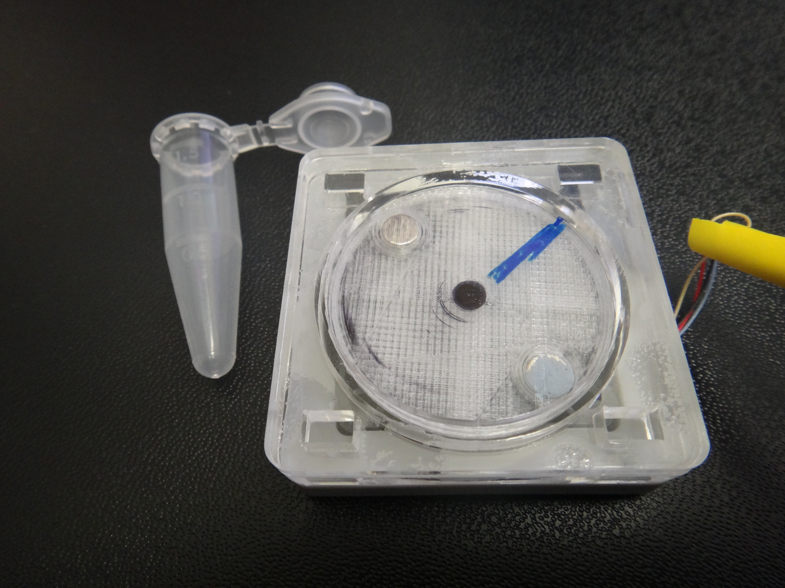
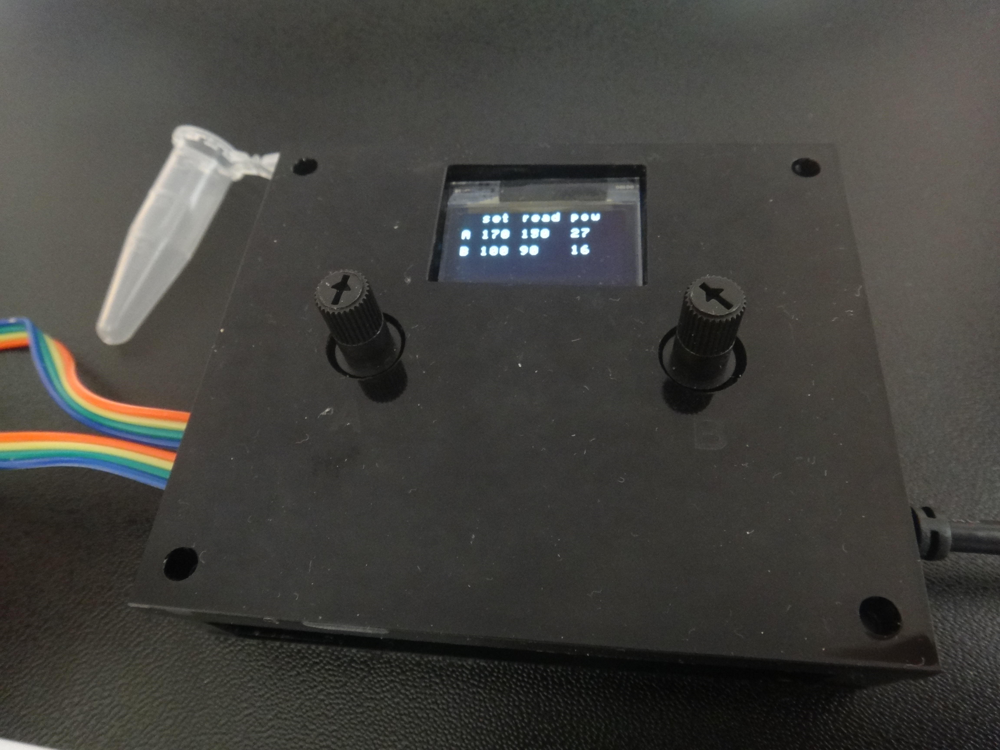
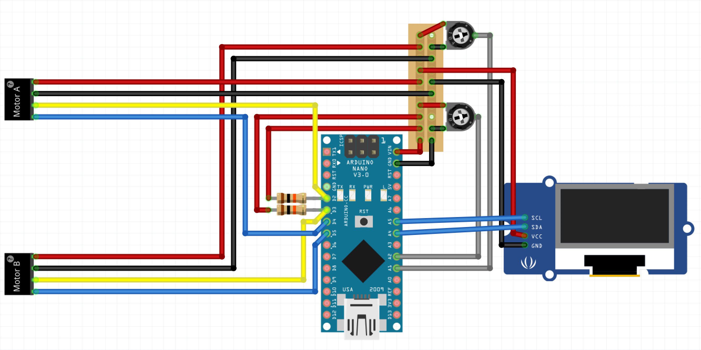
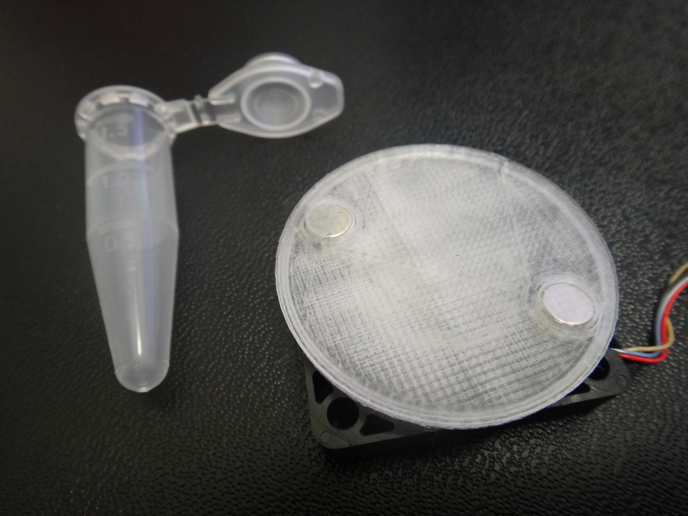
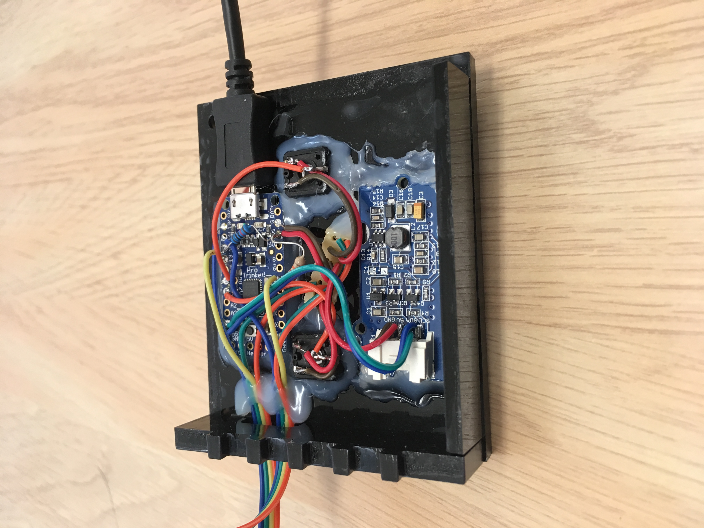

# Compact, Inexpensive, USB-Powered Magnetic Stirrer Device

**This page describes how to build a simple magnetic actuator for stirring the contents of a syringe. Applications are numerous, including the continuous delivery of cells and particles into droplets for single cell transcriptome profiling.**

This project is a fork of the original [DropletKitchen](https://DropletKitchen.github.io) project. Original source code of the project is provided under MIT License. The source may contain code under a different license, if this is the case it is stated in the LICENSE file.
The designs and documentation in this repository is Copyright (c) 2018 Simon Lane and made available under a [Creative Commons Attribution 4.0 International (CC BY 4.0)](https://creativecommons.org/licenses/by/4.0/) License.

## Introduction

 

Maintaining cells and particles in a suspended state within a fluid medium is essential for efficient processes spanning academic research to industrial settings. A major problem is the sedimentation of cells and particles to the bottom of the vessel, effectively removing them from the process. For example, settling in a syringe prevents the delivery to devices for microfluidic processing. This results in a large proportion of cells and particles not entering the microfluidic device, and even over short, minute periods can deplete the delivery of cells and particles to zero. Where samples are precious and reagents are expensive methods to overcome sedimentation are needed. 
Existing approaches include costly magnetic actuators that can be cumbersome for interfacing with syringes in a standard lab. Here we present an inexpensive and easy to build device with a compact footprint that can be used to greatly improve syringe-pump driven cell and particle delivery. We repurpose a small fan with pulse width modulation (PWM) control and a built-in tachometer. A feedback loop is established using an Arduino so that the RPM can be set via a simple controller. A small screen (optional) can display the RPM. Here we attach two fans to a single controller, but potentially 4 could be added. The fan motor has a low power requirement and so the whole device can be powered over USB, either from a nearby computer or a mains powered USB adapter.
To prevent sedimentation inside a syringe a pair of two neodymium disc magnet pairs (Ø4 mm, 2 mm thick) are attached to the fan using a 3D printed push-fit adapter. Small (e.g. 7x2 mm) magnetic stirrer bars are placed with the cell and particle suspension in the barrel of the syringe and are periodically actuated as the disc magnets rotate in close proximity. This prevents the sedimentation and ensures steady-state cell and particle delivery to the microfluidic device.

## Bill of Materials

This list assumes two stirrers running from a single controller. Costs are approximate as of July 2018.

Part | Number | Product Code | Company | Cost (Aprox. GBP)
---|---|---|---|---
Fan | 2 | 108-ASB0305HP-00CP4 | Mouser | 6.44 ea.
Disc Magnets  |  2 x 4  |  F042-N35   | First4Magnets  |  4.84 (50) or 0.10 ea
Magnetic stirrer bars  |  2 x 2  |  Z118842-3EA   | Sigma-Aldrich   | 15.40 (3)
Arduino nano (or similar)  |  1  |  1050-1001-ND | Digi-Key  |  16.66
USB cable   | 1   | 121-6574   | RS Online  |  2.41
Potentiometer  |  2   | 3362P-103TLF-ND |Digi-Key   | 2.05 ea
10KOhm Resister |   2   | CF14JT10K0CT-ND   | Digi-Key  |  0.08 ea
Protoboard  |  1     |   V2018-ND  |Digi-Key   | 4.56
OLED screen  |  1  |  713-104030008  |  Mouser  |  11.28
Wires  |  1   | 214-0661 |  RS Online   | 14.29
Heat shrink tube  |  1   | 700-4532   | RS Online  |  8.70 
Acrylic (410x280; 3 mm)  |  1    | TAAC3-C3-5   | Technsoft   | £14.75 (5 sheets)
Acrylic (410x280; 5 mm)  |  1    | TAAC3-C5-5   | Technsoft   | £22.25 (5 sheets)
Fast Acrylic Weld Cement   | 1   | WC102 (500 mL)  |  Bondrite Adhesives Ltd  |  £19.20
Sugru  |  1  |  -  |  Amazon  |  ~£6.00

## Wiring diagram

## Assembly - electronics

There is no need to add headers to the arduino board, solder the connections directly to the board according to the wiring diagram above. A short strip of protoboard is used to create a 5V rail for all the 5V power connections (motors, screen & potentiometers).

The potentiometers are used to allow user input of the desired RPM, their central pins are connected to pins A1 or A2 (suitable for analog read of the potentiometer voltage). 

The screen will be programmed to display the set point and current RPM for each motor. It connects to pins A4 and A5 designated as the SCL and SDA pins on the arduino nano.

The tachometer pin (yellow) of each motor must be pulled high using a resistor (I used 10kOhm), and connected to digital pins 2 or 3 on the arduino nano, as these pins can be connected to interrupts to enable more accurate assesment of RPM. The PWM pins of the motor are connected to digital pins 4 or 5 (or any capable of PWM output)
Wires should be long enough to reach your pumps, in our case we used wires around 40cm long.

## Assembly - Fan

3D print the . Add in two magnets using glue, orientate the mangets with the same polarity.

The magnet holder has been designed to snap-fit onto the fan (mouser: 108-ASB0305HP-00CP4), but depending on exact print conditions may need slight adjustments to the arms, e.g. with a scalpel. A central fit over the motor is key, otherwise vibration will be a problem.

Laser cut the  from acrylic sheet (3mm), or design your own custom one to fit your application. The design should leave the mangets free to rotate in close proximity to the syringe.

## Assembly - Controller

The screen and potentiometers were attached to the controller front plate first with hot glue. Then other components were added into the remainng spaces. 

## Arduino code

The provided  can be uploaded to the board by following the instructions to  and .

